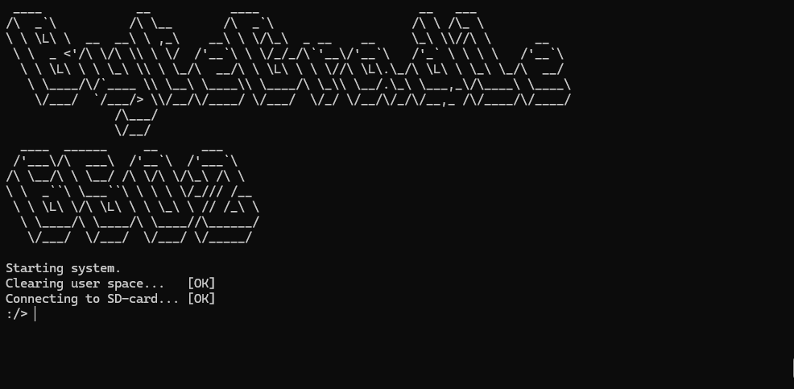

# ByteCradle 6502 Operating System

[](https://github.com/ifilot/bytecradle-6502-operating-system/actions/workflows/build.yml)

This repository contains the **software stack** for the ByteCradle 6502 platform:

- a terminal-based emulator
- BCOS (ByteCradle OS) ROM sources
- firmware/environment ROMs
- sample user programs



> [!NOTE]
> This repository only contains the operating system implementation. For the
> hardware, please [see this repository](https://github.com/ifilot/bytecradle-6502).

## Repository layout

- `emulator/` - C++ emulator (`bc6502emu`) and helper scripts.
- `src/`      - Operating system
- `programs/` - example programs that target BCOS.

## Dependencies

### Required build tools

- `make`
- `python3`
- `cmake`
- C++ compiler with C++17 support (e.g. `g++`)
- [cc65](https://cc65.github.io/) toolchain (`ca65`, `ld65`, `cc65`, `ar65`)

Example install on Ubuntu/Debian:

```bash
sudo apt update
sudo apt install -y build-essential cmake make python3 cc65
```

## Build instructions

### 1) Build the emulator

```bash
cmake -S emulator/src -B emulator/build
cmake --build emulator/build -j
```

### 2) Build BCOS

From the repository root:

```bash
make -C src
```

### 3) Build sample programs

```bash
make -C programs
```

## Notes on generated artifacts

The BCOS ABI/jump-table artifacts are generated by:

- `src/generate_bcos_artifacts.py`

This script is invoked automatically by both `make -C src` and `make -C programs`.

## Running the emulator

Example (mini board + SD image):

```bash
./emulator/build/bc6502emu -b mini -r src/bcos.bin -s emulator/script/sdcard.img
```

## License

Software in this repository is licensed under the GNU GPL v3.0. See `LICENSE-GPL.txt`.